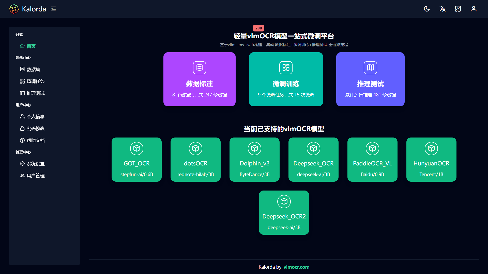

<p align="center">

</p>
<h1 align="center" style="font-size: 60px;"><b>Kalorda</b></h1>
<p align="center" style="font-size: 25px;"><b>轻量vlmOCR模型一站式微调平台</b></p>
<p align="center">
<a href="https://github.com/modelscope/ms-swift" target="_blank"></a>
<a href="https://github.com/vllm-project/vllm" target="_blank"></a>
<a href="https://vuejs.org/"></a> 
<a href="https://github.com/vlmOCR/Kalorda"></a>
<a href="https://pypi.org/project/kalorda"></a>
<a href="https://kalorda.vlmocr.com"></a>
<br/>
<a href="README_CN.md">中文</a>&nbsp;&nbsp;<a href="README.md">English</a>
</p>

🔥 好消息: Kalorda现已支持 FireRed-OCR 模型 以及最新vllm v0.16.0、ms-swift v4.0.0

🔥 好消息：Kalorda现已支持Deepseek-OCR-2模型微调训练，特别支持v0.13/0.14/0.15等高版本vLLM对Deepseek-OCR-2的运行推理（全网首发）



## 概述
Kalorda是一个轻量vlmOCR模型微调集成平台，前端采用Typescript+Vue3+Vite，后端采用Python+FastAPI+ms-swift+vLLM构建，提供针对主流轻量vlmOCR模型的数据二次标注、微调训练、对比测试等一站式综合解决方案。

当前vlmOCR模型蓬勃发展，不同模型都有各自的优势但也有不足，实际应用时需要对模型进行二次微调以提升在特定业务场景下的识别能力。虽然在数据标注、微调训练、模型推理等各环节已有很多优秀开源组件可供选择和使用，但还是缺少可针对不同ocr模型微调、能将各环节流程串起来的一体协同工具，非熟练专业人员想开展微调工作（哪怕只是调工具）其实并不方便也不容易。Kalorda通过对ms-swift+vllm等主流工具的封装并对主流ocr模型深度集成，提供直观友好的可视化WEB操作界面，能够让vlmOCR模型的微调门槛降低，操作使用更加简单方便。

当前已支持的vlmOCR模型：

| 模型名称 | 模型大小 | 发布日期 | 发布厂家|
| ----------- | ----------- | ----------- | ----------- |
| GOT-OCR2.0 | 0.6B     | 2025年5月 | 阶跃星辰 |
| dotsOCR    | 3B       | 2025年7月 | 小红书 |
| Dolphin_v2 | 3B       | 2025年11月 | 字节跳动 |
| Deepseek_OCR | 3B     | 2025年11月 | 深度求索 |
| PaddleOCR_VL | 0.9B   | 2025年11月 | 百度 |
| HunyuanOCR   | 1B     | 2025年12月 | 腾讯 |
| Deepseek_OCR2 | 3B     | 2026年1月 | 深度求索 |
| FireRed_OCR | 2B     | 2026年3月 | 小红书 |

更多模型会持续集成，欢迎大家提交PR或issue一起完善。

## 安装

### 快速安装
Kalorda安装包已发布至 [PyPI](https://pypi.org/) 中央仓库，不用下载 git 源码，直接使用 pip 安装即可使用。
### 1、新建虚拟环境

```
# 使用 conda 新建虚拟环境
conda create -n kalorda python=3.12 -y

# 激活（切换）虚拟环境
conda activate kalorda
```
### 2、安装命令
```
pip install kalorda

# 或指定阿里云镜像源进行安装
pip install kalorda -i https://mirrors.aliyun.com/pypi/simple/
```

### 3、启动命令

```
kalorda --port 8800
```
可选启动参数：
- `--host`：指定主机地址，默认值为 `0.0.0.0`
- `--port`：指定端口号，默认值为 `8800`
- `--gpu-devices`：指定允许使用的GPU设备索引（从0开始），默认值为空表示不限制（即全部GPU都可使用），多个GPU用逗号分隔，例如 `--gpu-devices 0,1,2`
- `--workers`：指定工作进程数（至少要2个工作进程），默认值为 `2`
- `--log-level`：指定日志级别，默认值为 `info`

### 4、登录账号
```
初始管理员账号Admin密码admin123
```

### 系统和硬件条件：
- Linux操作系统（Windows下请安装wsl2 ubuntu子系统）
- Python虚拟环境管理工具（推荐使用miniconda3或uv）
- 至少一张Nvidia GPU显卡，显存16G或以上，已安装显卡驱动及CUDA（非Nvidia显卡当前暂不支持，等后续）
- 硬盘空间：50GB或以上

### 源码安装
如果您想使用前后端分离的方式安装或调试项目，可按照以下步骤操作：
### 1、下载源码
```
git clone https://github.com/vlmOCR/Kalorda.git
```
### 2、安装运行
本项目分为前端和后端两个部分，分别位于项目根目录下的frontend/和backend/目录。
```
Kalorda
├── backend/     # 后端项目目录
├── frontend/    # 前端项目目录
├── LICENSE      # 项目许可证（Apache-2.0）
└── README.md    # github首页
```
安装后端项目并启动（因依赖的vLLM组件不支持纯windows系统，后端项目必须在linux或windows/wsl2子系统运行）
```
# 进入后端项目目录（具体路径请根据实际修改）
cd /mnt/d/test/Kalorda/backend/

# 使用 conda 新建虚拟环境
conda create -n kalorda python=3.12 -y

# 激活（切换）虚拟环境
conda activate kalorda

# 安装依赖
pip install -e .[dev]

# 启动运行（进入src/kalorda目录）
cd /mnt/d/test/Kalorda/backend/src/kalorda/
python -m main --port 8800
```

安装前端项目并启动（操作系统不限，但须要有Node.js环境）

```
# 进入前端项目目录（具体路径请根据实际修改）
cd d:/test/Kalorda/frontend/

# 安装依赖
npm install

# 打开前端项目目录下的 .env.dev 配置文件，修改 VITE_API_SERVER_URL 值为已启动的kalorda后端地址
# 例如：VITE_API_SERVER_URL=http://172.18.35.246:8800 （注意：ip地址要根据实际后端运行地址进行修改）

# 启动运行
npm run dev

# 访问前端页面（前端默认端口为8060，可在 vite.config.ts 文件中修改 server.port 值）
# 打开浏览器，访问 http://localhost:8060 
```


## 项目打包
先执行前端打包
```
# 进入前端项目目录（具体路径请根据实际修改）
cd d:/test/Kalorda/frontend/

# 执行前端打包命令
npm run build
```
打包后的静态资源文件默认会保存到/backend/src/kalorda/web_dist目录（便于接下来后端打包时包含静态资源文件）

再执行后端打包
```
# 进入后端项目目录（具体路径请根据实际修改）
cd /mnt/d/test/Kalorda/backend/

# 安装打包工具build
pip install build

# 执行打包命令
python -m build
```
打包后的whl文件默认保存在/backend/dist目录下,
例如：kalorda-0.1.6-py3-none-any.whl 安装whl文件命令为
```
pip install kalorda-0.1.6-py3-none-any.whl
```
## 💡联系交流
邮箱：[postmaster@vlmocr.com](mailto:postmaster@vlmocr.com)

GitHub/Issues：[https://github.com/vlmOCR/Kalorda/issues](https://github.com/vlmOCR/Kalorda/issues)

微信：llery2021


(扫码添加微信，备注：kalorda，邀您加入群聊)

## 📜License
Kalorda项目基于Apache-2.0协议开源，您可以在遵守协议的前提下自由使用、修改和分发本项目。

[Apache-2.0](LICENSE)

Copyright (c) 2025-present, Kalorda
